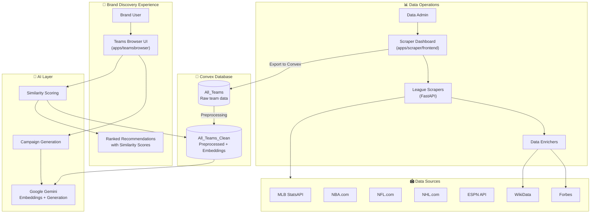
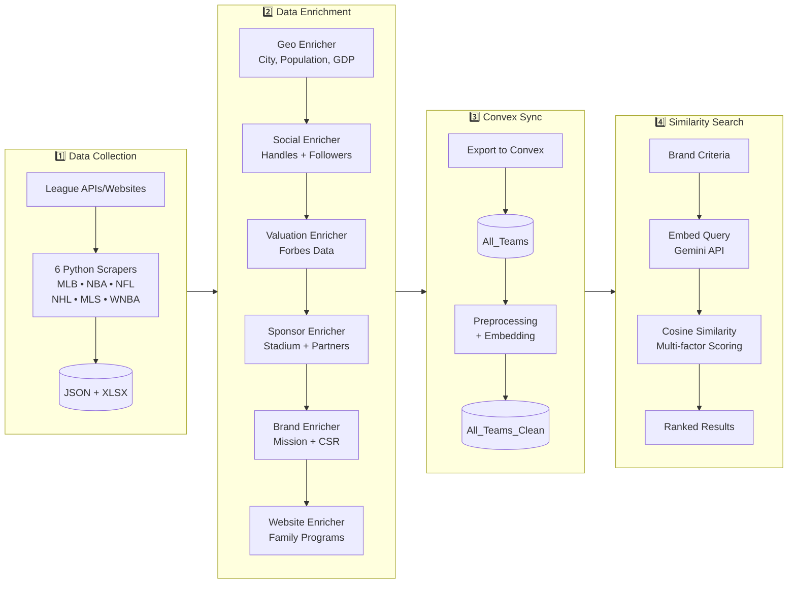
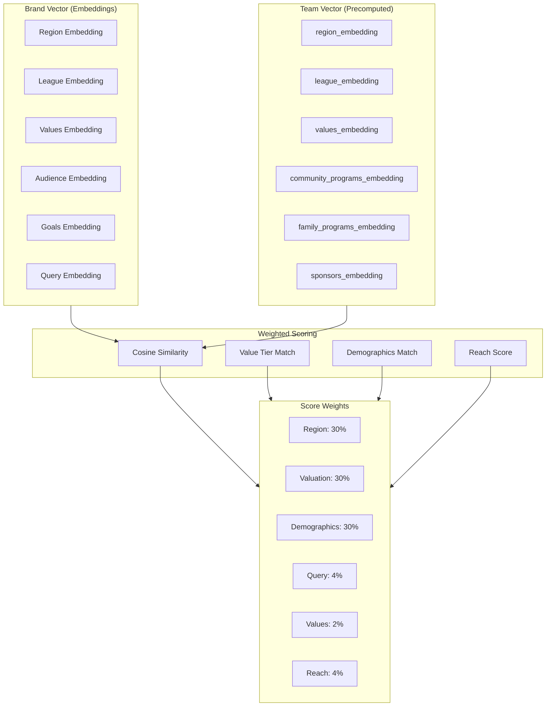

# PlayMaker Sponsorship Search

**Project Leads:** Yubi Mamiya, Ibraheem Amin

An AI-powered sports sponsorship discovery platform that helps brands find optimal team partnership opportunities through semantic similarity matching, real-time recommendations, and comprehensive data enrichment.

---

## Table of Contents

- [Overview](#overview)
- [Architecture](#architecture)
- [Project Structure](#project-structure)
- [System Components](#system-components)
- [Technology Stack](#technology-stack)
- [Setup & Installation](#setup--installation)
- [Environment Variables](#environment-variables)
- [Development Workflow](#development-workflow)
- [Future Roadmap](#future-roadmap)

---

## Overview

### Problem Statement

Brands seeking sports sponsorship opportunities face significant challenges:
- **Information Asymmetry**: Difficulty finding comprehensive data on teams across leagues
- **Analysis Paralysis**: No structured way to evaluate thousands of potential partnerships
- **Budget Opacity**: Unclear sponsorship pricing across different market tiers
- **Audience Mismatch**: Risk of partnering with teams whose demographics don't align

### Solution

PlayMaker Sponsorship Search provides an **AI-powered semantic search experience** for sports sponsorship discovery:

1. **Semantic Similarity Matching**: Brands input preferences (budget, region, demographics, values)
2. **Vector-Based Scoring**: System embeds brand criteria and computes cosine similarity against 500+ team embeddings
3. **Ranked Recommendations**: Results are sorted by match score with detailed team data
4. **AI Campaign Generation**: Generate sponsorship campaigns with creative assets and activation ideas

### Key Features

- **Semantic Embedding Search**: Uses Google Gemini embeddings for intelligent brand-to-team matching
- **Comprehensive Team Database**: 500+ teams across 10+ leagues with enriched data
- **Multi-Source Data Enrichment**: Automated enrichers for social media, valuations, sponsors, and more
- **Campaign Generator**: AI-powered campaign creation with visual generation
- **Paginated Results**: Fast, responsive UI with prefetching for smooth pagination
- **Export to Convex**: One-click sync from scrapers to production database

### Supported Leagues

| League | Teams | Data Sources |
|--------|-------|--------------|
| **NFL** | 32 | NFL.com, ESPN API, Forbes |
| **NBA** | 30 | NBA.com, WikiData, Forbes |
| **G League** | 30+ | G League directory |
| **WNBA** | 13 | ESPN API, WNBA.com |
| **MLB** | 30 | MLB StatsAPI, Forbes |
| **MiLB** | 120+ | MLB StatsAPI (AAA, AA, A+, A, Rookie) |
| **NHL** | 32 | NHL.com, Forbes |
| **AHL** | 32 | TheAHL.com |
| **ECHL** | 28 | ECHL.com |
| **MLS** | 29 | ESPN API |
| **NWSL** | 14 | ESPN API |

---

## Architecture

### High-Level System Overview



### Data Pipeline Architecture



### Similarity Scoring Algorithm

The scoring system combines multiple factors:



---

## Project Structure

```
PM-SponsorshipSearch/
├── apps/
│   ├── teamsbrowser/              # 🎯 MAIN UI - Teams Browser (Vite + React)
│   │   ├── src/
│   │   │   ├── App.tsx            # Main application with search flow
│   │   │   ├── components/
│   │   │   │   ├── PromptEditor.tsx      # Brand criteria input form
│   │   │   │   ├── RecommendationCard.tsx # Team result card
│   │   │   │   ├── TeamDetailView.tsx    # Full team details + analysis
│   │   │   │   ├── CampaignGeneratorModal.tsx # AI campaign creation
│   │   │   │   ├── CampaignView.tsx      # Campaign display
│   │   │   │   └── Sidebar.tsx           # Navigation
│   │   │   ├── lib/
│   │   │   │   ├── api.ts         # Convex API client
│   │   │   │   └── ai.ts          # AI utilities
│   │   │   └── types/
│   │   │       └── index.ts       # TypeScript types
│   │   └── README.md
│   │
│   ├── scraper/                   # 📊 Data Scraping System
│   │   ├── backend/               # FastAPI Python server
│   │   │   ├── main.py            # API routes + task management
│   │   │   ├── scrapers/
│   │   │   │   ├── mlb_milb.py    # MLB + Minor Leagues
│   │   │   │   ├── nba_gleague.py # NBA + G League
│   │   │   │   ├── nfl.py         # NFL
│   │   │   │   ├── nhl_ahl_echl.py # NHL + AHL + ECHL
│   │   │   │   ├── wnba.py        # WNBA
│   │   │   │   ├── mls_nwsl.py    # MLS + NWSL
│   │   │   │   └── enrichers/     # Data enrichment modules
│   │   │   │       ├── geo_enricher.py
│   │   │   │       ├── social_enricher.py
│   │   │   │       ├── valuation_enricher.py
│   │   │   │       ├── sponsor_enricher.py
│   │   │   │       ├── brand_enricher.py
│   │   │   │       └── website_enricher.py
│   │   │   └── data/              # Scraped output files
│   │   │
│   │   ├── frontend/              # Scraper dashboard (Vite)
│   │   ├── README.md              # Scraper documentation
│   │   └── SCRAPER_ENRICHER_GUIDE.md # Detailed enricher guide
│   │
│   └── web/                       # ⚠️ DEPRECATED - Old Next.js frontend
│       └── README.md              # Deprecation notice
│
├── packages/
│   └── backend/                   # Convex Serverless Backend
│       └── convex/
│           ├── schema.ts          # Database schema
│           ├── similarityScoring.ts # Embedding-based search
│           ├── teamAnalysis.ts    # AI team analysis
│           ├── campaignGeneration.ts # AI campaign creation
│           ├── scraperImport.ts   # Data import mutations
│           ├── All_Teams_Clean.ts # Preprocessed data queries
│           ├── dataPreProcess.ts  # Embedding preprocessing
│           └── README.md
│
├── turbo.json                     # Turborepo configuration
├── package.json                   # Monorepo workspace
└── README.md                      # This file
```

---

## System Components

### 1. Teams Browser (`apps/teamsbrowser`) — **Primary UI**

The main user-facing application for brand users to discover sponsorship opportunities.

**Key Features:**
- Semantic search with multi-criteria input (regions, demographics, values, goals)
- Paginated results with prefetching for instant page transitions
- Team detail views with AI-generated analysis
- Campaign generator with visual creation
- Score-based ranking with transparent weighting

**Components:**

| Component | Purpose |
|-----------|---------|
| `PromptEditor` | Multi-field form for brand criteria input |
| `RecommendationCard` | Team preview card with score and key stats |
| `TeamDetailView` | Full team profile with AI analysis |
| `CampaignGeneratorModal` | AI campaign creation workflow |

### 2. Convex Backend (`packages/backend`)

Serverless backend handling data storage, similarity computation, and AI operations.

**Key Modules:**

| Module | Responsibility |
|--------|----------------|
| `similarityScoring.ts` | Embedding-based similarity computation with pagination |
| `teamAnalysis.ts` | AI-powered team analysis generation |
| `campaignGeneration.ts` | Campaign and visual generation |
| `scraperImport.ts` | Batch import of scraped data |
| `dataPreProcess.ts` | Team data preprocessing and embedding |
| `All_Teams_Clean.ts` | Queries for preprocessed team data |

**Database Tables:**

| Table | Purpose |
|-------|---------|
| `All_Teams` | Raw team data imported from scrapers |
| `All_Teams_Clean` | Preprocessed data with embeddings for search |
| `teams` | Legacy team data (deprecated) |
| `searchSessions` | User query tracking |
| `researchCache` | AI discovery cache |

### 3. Scraper System (`apps/scraper`)

Comprehensive data collection and enrichment pipeline.

**Scrapers:**

| Scraper | Leagues | Teams | Data Source |
|---------|---------|-------|-------------|
| `mlb_milb.py` | MLB, AAA, AA, A+, A, Rookie | ~190 | MLB StatsAPI |
| `nba_gleague.py` | NBA, G League | ~60 | NBA.com |
| `nfl.py` | NFL | 32 | NFL.com |
| `nhl_ahl_echl.py` | NHL, AHL, ECHL | ~90 | NHL.com, TheAHL, ECHL |
| `wnba.py` | WNBA | 13 | ESPN API |
| `mls_nwsl.py` | MLS, NWSL | ~43 | ESPN API |

**Enrichers:**

| Enricher | Fields Added |
|----------|--------------|
| `GeoEnricher` | geo_city, geo_country, city_population, metro_gdp |
| `SocialEnricher` | social_handles, followers_x/instagram/facebook/tiktok, subscribers_youtube |
| `ValuationEnricher` | avg_ticket_price, franchise_value, annual_revenue |
| `SponsorEnricher` | owns_stadium, stadium_name, sponsors |
| `BrandEnricher` | mission_tags, community_programs, cause_partnerships |
| `WebsiteEnricher` | family_program_count, family_program_types |

---

## Technology Stack

### Frontend
| Technology | Purpose |
|------------|---------|
| React 18 | UI library |
| Vite | Build tool |
| TypeScript | Type safety |
| Tailwind CSS | Styling |
| Hugeicons | Icon library |

### Backend
| Technology | Purpose |
|------------|---------|
| Convex | Serverless database + functions |
| FastAPI | Python scraper API |
| Uvicorn | ASGI server |

### AI & Data
| Technology | Purpose |
|------------|---------|
| Google Gemini | Embeddings + text generation |
| Gemini Imagen 3 | Image generation |
| WikiData SPARQL | Social handles, stadium data |
| Forbes | Team valuations |
| Data Commons | Population data |

---

## Setup & Installation

### Prerequisites

- Node.js 18+
- Python 3.11+
- npm or pnpm
- Convex account

### 1. Clone and Install

```bash
git clone <repository-url>
cd PM-SponsorshipSearch

# Install Node dependencies
npm install

# Install Turborepo globally
npm install turbo --global
```

### 2. Configure Convex

```bash
cd packages/backend
npx convex login
npx convex dev  # Start local dev server
```

### 3. Setup Scraper Backend

```bash
cd apps/scraper/backend

# Create virtual environment
python3 -m venv venv
source venv/bin/activate

# Install dependencies
pip install -r requirements.txt

# Create .env file with API keys (see Environment Variables)
```

### 4. Start Development

From the root directory:

```bash
turbo dev
```

This starts:
- **apps/teamsbrowser** on `http://localhost:5173`
- **apps/scraper/frontend** on `http://localhost:5174`
- **apps/scraper/backend** on `http://localhost:8000`
- **packages/backend** (Convex dev server)

---

## Environment Variables

### Convex Dashboard

Set in Convex Dashboard → Settings → Environment Variables:

| Variable | Required | Description |
|----------|----------|-------------|
| `GEMINI_API_KEY` | Yes | Google AI API key for embeddings |
| `GOOGLE_GENERATIVE_AI_API_KEY` | Yes | Gemini API key for generation |

### Scraper Backend (`.env` file)

Create `apps/scraper/backend/.env`:

```env
GOOGLE_GENERATIVE_AI_API_KEY=your-key-here
YOUTUBE_API_KEY=your-key-here           # Optional: for follower counts
DATA_COMMONS_API_KEY=your-key-here      # Optional: for population data
```

### Teams Browser

Create `apps/teamsbrowser/.env`:

```env
VITE_CONVEX_URL=https://your-deployment.convex.cloud
```

---

## Development Workflow

### 1. Scrape New Team Data

```bash
# Navigate to scraper backend
cd apps/scraper/backend
source venv/bin/activate

# Run via API (start server first)
uvicorn main:app --reload --port 8000

# Or use the frontend dashboard at http://localhost:5174
```

### 2. Enrich Team Data

Using the scraper dashboard:
1. Select a scraper with data
2. Click "Run Enrichment"
3. Select enrichers to apply
4. Monitor progress in real-time

### 3. Export to Convex

```bash
# From scraper dashboard, click "Export to Convex"
# Or use the API:
curl -X POST http://localhost:8000/api/convex/export-all \
  -H "Content-Type: application/json" \
  -d '{"mode": "overwrite"}'
```

### 4. Preprocess for Search

Run the preprocessing script in Convex to generate embeddings:

```typescript
// In Convex Dashboard → Functions → Run
await ctx.runAction(api.dataPreProcess.preprocessAllTeams, {});
```

---

## Future Roadmap

### Phase 1: Data Quality ✅
- [x] 6 league scrapers with fallback data
- [x] 6 enrichers for comprehensive team data
- [x] Source tracking and citations
- [x] Export to Convex pipeline

### Phase 2: Semantic Search ✅
- [x] Gemini embedding integration
- [x] Multi-factor similarity scoring
- [x] Paginated results with prefetching
- [x] Sport/league filtering

### Phase 3: AI Features ✅
- [x] AI team analysis generation
- [x] Campaign generation with touchpoints
- [x] Visual generation with Imagen 3

### Phase 4: Enhanced UX (In Progress)
- [ ] Search history persistence
- [ ] Saved teams / favorites
- [ ] Campaign export (PDF/PPTX)
- [ ] User accounts and preferences

### Phase 5: Platform Integration (Planned)
- [ ] Connect to PlayMaker sales portal
- [ ] CRM integration
- [ ] Deal proposal workflows
- [ ] Analytics dashboard

---

## License

Proprietary - PlayMaker Inc.

---

## Contributing

Internal project - contact project leads for contribution guidelines.
