# PlayMaker Sponsorship Search

**Project Leads:** Yubi Mamiya, Ibraheem Amin

An AI-powered sports sponsorship discovery platform that helps brands find optimal team partnership opportunities through intelligent search, real-time recommendations, and dynamic data enrichment.

---

## Table of Contents

- [Overview](#overview)
- [Architecture](#architecture)
- [Project Structure](#project-structure)
- [System Components](#system-components)
- [Data Flow](#data-flow)
- [Technology Stack](#technology-stack)
- [Setup & Installation](#setup--installation)
- [Environment Variables](#environment-variables)
- [API Reference](#api-reference)
- [Future Roadmap](#future-roadmap)

---

## Overview

### Problem Statement

Brands seeking sports sponsorship opportunities face significant challenges:
- **Information Asymmetry**: Difficulty finding comprehensive data on teams across leagues
- **Analysis Paralysis**: No structured way to evaluate thousands of potential partnerships
- **Budget Opacity**: Unclear sponsorship pricing across different market tiers
- **Audience Mismatch**: Risk of partnering with teams whose demographics don't align

### Solution

PlayMaker Sponsorship Search provides a **Perplexity-style search experience** for sports sponsorship discovery:

1. **Intelligent Search**: Brands input preferences (budget, region, demographics, values)
2. **Real-time Discovery**: System searches database + AI-powered web research
3. **Streamed Recommendations**: Results stream to UI with reasoning, pros/cons, and deal structures
4. **Transparent Sourcing**: AI-discovered teams include source citations for credibility

### Key Features

- **Hybrid Data Architecture**: Combines curated database with real-time AI discovery
- **Server-Sent Events (SSE)**: Progressive streaming of search results
- **Multi-tier Team Coverage**: NFL, NBA, MLB, NHL, MLS, NWSL, MiLB, USL, AHL, ECHL
- **Automated Scraping**: Python-based scrapers for team data with logo enrichment
- **Research Caching**: 24-hour TTL cache to optimize API costs
- **Search History**: Persistent session tracking for analytics and user convenience

---

## Architecture

### High-Level System Overview

The platform consists of two main workflows: **Data Collection** (scraping team data from league APIs) and **Intelligent Search** (AI-powered brand-to-team matching). These converge on a shared Convex database.

```mermaid
flowchart TB
    subgraph UserFacing["🎯 Brand Discovery Experience"]
        Brand["Brand User"]
        SearchUI["Search Interface<br/>(apps/web)"]
        Results["Streamed Recommendations<br/>with Scores & Reasoning"]
    end

    subgraph DataOps["📊 Data Operations"]
        Admin["Data Admin"]
        ScraperUI["Scraper Dashboard<br/>(apps/scraper/frontend)"]
        Scrapers["League Scrapers<br/>(FastAPI)"]
    end

    subgraph Intelligence["🧠 AI Layer"]
        Gemini["Google Gemini 2.0"]
        Tavily["Tavily Web Search"]
    end

    subgraph DataLayer["💾 Unified Data Platform"]
        ConvexDB[("Convex Database<br/>• teams<br/>• searchSessions<br/>• researchCache")]
    end

    subgraph Sources["🏟️ Data Sources"]
        MLB["MLB StatsAPI"]
        NBA["NBA API"]
        NFL["NFL API"]
        NHL["NHL API"]
    end

    Brand -->|"Query + Filters"| SearchUI
    SearchUI -->|"SSE Stream"| Results
    SearchUI -->|"Search Request"| ConvexDB

    Admin --> ScraperUI
    ScraperUI -->|"Run/Monitor"| Scrapers
    Scrapers -->|"Fetch Teams"| Sources
    Scrapers -->|"🔜 Export to Convex"| ConvexDB

    ConvexDB -->|"If < 3 results"| Gemini
    Gemini -->|"Research"| Tavily
    Gemini -->|"Discovered Teams"| ConvexDB

    ConvexDB -->|"🔜 AI Enrichment"| Gemini
```



### Data Pipeline Architecture

This diagram shows how data flows from league APIs through scraping, enrichment, and ultimately powers the search experience.

```mermaid
flowchart LR
    subgraph Collection["1️⃣ Data Collection"]
        direction TB
        APIs["League APIs<br/>MLB • NBA • NFL • NHL"]
        Scrapers["Python Scrapers"]
        LocalData[("Local Storage<br/>JSON + XLSX")]
        
        APIs --> Scrapers
        Scrapers --> LocalData
    end

    subgraph Curation["2️⃣ Data Curation"]
        direction TB
        Dashboard["Scraper Dashboard"]
        Edit["Inline Editing"]
        Clean["AI Region Cleaning"]
        Logos["Logo Enrichment"]
        
        Dashboard --> Edit
        Dashboard --> Clean
        Dashboard --> Logos
    end

    subgraph Sync["3️⃣ Convex Sync"]
        direction TB
        Export["Export to Convex<br/>(Planned)"]
        ConvexDB[("Convex DB<br/>teams table")]
        
        Export --> ConvexDB
    end

    subgraph Inference["4️⃣ AI Inference"]
        direction TB
        Search["Brand Search Query"]
        Scoring["Multi-factor Scoring"]
        Discovery["AI Team Discovery"]
        Enrichment["Data Enrichment<br/>(Planned)"]
        
        Search --> Scoring
        Scoring --> Discovery
        Discovery --> Enrichment
    end

    subgraph Output["5️⃣ Recommendations"]
        direction TB
        Stream["SSE Stream"]
        Cards["Team Cards<br/>Score • Reasoning<br/>Pros/Cons • Deal Structure"]
        
        Stream --> Cards
    end

    Collection --> Curation
    Curation --> Sync
    Sync --> Inference
    Inference --> Output

    LocalData -.->|"Current"| Dashboard
    ConvexDB -.->|"Provides Data"| Scoring
```



### Search Flow Sequence

Detailed view of what happens when a brand searches for sponsorship opportunities.

```mermaid
sequenceDiagram
    autonumber
    participant B as Brand User
    participant UI as Next.js Frontend
    participant HTTP as Convex HTTP Endpoint
    participant DB as Convex Database
    participant AI as Gemini AI
    participant Web as Tavily Search

    B->>UI: Enter "affordable Texas sponsorship"
    B->>UI: Set filters (budget, region, values)
    
    UI->>HTTP: POST /search (SSE connection)
    
    HTTP->>DB: Create searchSession
    HTTP-->>UI: 📡 event: session {id}
    
    HTTP-->>UI: 📡 event: step {analyze: active}
    
    HTTP->>DB: Query teams table
    DB-->>HTTP: teams[] (matching filters)
    
    HTTP-->>UI: 📡 event: step {search: completed}
    
    alt Less than 3 teams found
        HTTP-->>UI: 📡 event: info "Searching for more teams..."
        
        HTTP->>AI: discoverTeams(query, filters)
        AI->>Web: Search sports sponsorship data
        Web-->>AI: Search results + sources
        AI->>AI: Extract structured team data
        AI-->>HTTP: discovered teams + sourceUrls
        
        HTTP->>DB: Save discovered teams
        HTTP-->>UI: 📡 event: sources [{url, title}]
    end
    
    HTTP->>HTTP: Score & rank all teams
    HTTP-->>UI: 📡 event: step {rank: completed}
    
    loop For each top 10 team
        HTTP-->>UI: 📡 event: team {name, score, reasoning, pros, cons}
    end
    
    HTTP->>DB: Save searchResults
    HTTP-->>UI: 📡 event: complete {totalResults, usedAI}
    
    UI->>B: Display recommendation cards
```



### Component Architecture

How the frontend components are organized and interact.

```mermaid
flowchart TB
    subgraph WebApp["apps/web (Next.js)"]
        Page["page.tsx"]
        
        subgraph SearchFlow["Search Flow"]
            Panel["SearchPanel<br/>• Budget inputs<br/>• Region selector<br/>• Value checkboxes"]
            Stream["StreamingResults<br/>• SSE consumer<br/>• Progress display"]
        end
        
        subgraph Display["Result Display"]
            Timeline["TimelineFlow<br/>• Step indicators<br/>• Source links"]
            Cards["TeamCard[]<br/>• Score badge<br/>• Reasoning<br/>• Pros/Cons<br/>• Deal structure"]
        end
        
        subgraph Navigation["Navigation"]
            Sidebar["Sidebar<br/>• Search history<br/>• Quick re-run"]
        end
        
        Page --> Panel
        Page --> Stream
        Page --> Sidebar
        Stream --> Timeline
        Stream --> Cards
    end

    subgraph ScraperApp["apps/scraper/frontend (Vite)"]
        App["App.tsx"]
        
        subgraph ScraperFlow["Scraper Management"]
            ScraperCards["ScraperCard[]<br/>• Status badge<br/>• Run button<br/>• Last run info"]
            DataView["DataViewer<br/>• Team table<br/>• Inline editing<br/>• AI clean button"]
        end
        
        App --> ScraperCards
        App --> DataView
    end

    subgraph Backend["packages/backend (Convex)"]
        HTTPEndpoint["http.ts<br/>SSE /search"]
        SearchLogic["search.ts<br/>Scoring algorithm"]
        Research["research.ts<br/>AI discovery"]
        TeamsDB["teams.ts<br/>CRUD ops"]
        Cache["cache.ts<br/>24hr TTL"]
    end

    Panel -->|"POST"| HTTPEndpoint
    HTTPEndpoint --> SearchLogic
    HTTPEndpoint --> Research
    Research --> Cache
    SearchLogic --> TeamsDB

    style Page fill:#3b82f6,color:#fff
    style App fill:#8b5cf6,color:#fff
    style HTTPEndpoint fill:#f97316,color:#fff
```



### Database Schema

Entity relationships in the Convex database.


### Planned: Unified Data Flow

Future architecture with scraper → Convex export and enhanced AI inference.

```mermaid
flowchart TB
    subgraph Scraping["Data Collection Layer"]
        S1["MLB/MiLB Scraper"]
        S2["NBA/G League Scraper"]
        S3["NFL Scraper"]
        S4["NHL/AHL/ECHL Scraper"]
    end

    subgraph Processing["Data Processing"]
        Local[("Local JSON/XLSX")]
        Dashboard["Scraper Dashboard<br/>Edit • Clean • Review"]
        Export["📤 Export to Convex"]
    end

    subgraph Convex["Convex Platform"]
        TeamsDB[("teams table<br/>~500+ teams")]
        
        subgraph AIActions["AI Actions"]
            Enrich["enrichTeamData()<br/>• Demographics inference<br/>• Social media lookup<br/>• Sponsorship estimation"]
            Discover["discoverTeams()<br/>• Web research<br/>• New team finding"]
            Score["calculateMatchScore()<br/>• Multi-factor ranking"]
        end
    end

    subgraph Search["Search Experience"]
        Query["Brand Query"]
        Stream["SSE Stream"]
        Results["Ranked Recommendations"]
    end

    S1 & S2 & S3 & S4 --> Local
    Local --> Dashboard
    Dashboard -->|"🔜 One-click sync"| Export
    Export --> TeamsDB
    
    TeamsDB --> Enrich
    TeamsDB --> Score
    Score --> Discover
    Discover --> TeamsDB
    
    Query --> Score
    Score --> Stream
    Enrich --> Stream
    Stream --> Results

    style Export fill:#22c55e,color:#fff
    style Enrich fill:#f59e0b,color:#fff
```



---

## Project Structure

```
PM-SponsorshipSearch/
├── apps/
│   ├── web/                          # Main search frontend (Next.js)
│   │   ├── app/
│   │   │   ├── page.tsx              # Landing page + search orchestration
│   │   │   ├── layout.tsx            # Root layout with providers
│   │   │   ├── providers.tsx         # Convex client provider
│   │   │   └── globals.css           # Tailwind + custom animations
│   │   ├── components/
│   │   │   ├── search/
│   │   │   │   ├── SearchPanel.tsx   # Brand input form
│   │   │   │   ├── StreamingResults.tsx  # SSE result handler
│   │   │   │   ├── TeamCard.tsx      # Team recommendation card
│   │   │   │   ├── TimelineFlow.tsx  # Progress visualization
│   │   │   │   ├── Sidebar.tsx       # Search history panel
│   │   │   │   └── ProgressSteps.tsx # Step indicators
│   │   │   └── ui/                   # ShadCN UI components
│   │   └── hooks/
│   │       └── useStreamingSearch.ts # SSE connection hook
│   │
│   └── scraper/                      # Data scraping system
│       ├── backend/                  # FastAPI Python server
│       │   ├── main.py               # API routes + orchestration
│       │   ├── scrapers/
│       │   │   ├── mlb_milb.py       # MLB + Minor League scraper
│       │   │   ├── nba_gleague.py    # NBA + G League scraper
│       │   │   ├── nfl.py            # NFL scraper
│       │   │   ├── nhl_ahl_echl.py   # NHL + AHL + ECHL scraper
│       │   │   └── logo_utils.py     # Centralized logo fetching
│       │   ├── data/                 # Scraped output (JSON/XLSX)
│       │   ├── requirements.txt      # Python dependencies
│       │   └── dev.sh                # Startup script
│       │
│       └── frontend/                 # Scraper dashboard (Vite + React)
│           ├── src/
│           │   ├── App.tsx           # Dashboard layout
│           │   ├── components/
│           │   │   ├── ScraperCard.tsx   # Scraper status card
│           │   │   ├── DataViewer.tsx    # Data table + inline editing
│           │   │   └── StatusBadge.tsx   # Status indicators
│           │   ├── hooks/
│           │   │   └── useScrapers.ts    # Polling + data hooks
│           │   └── lib/
│           │       └── api.ts        # FastAPI client
│           └── package.json
│
├── packages/
│   ├── backend/                      # Convex serverless backend
│   │   └── convex/
│   │       ├── schema.ts             # Database schema definitions
│   │       ├── http.ts               # SSE streaming endpoint
│   │       ├── search.ts             # Search algorithm + scoring
│   │       ├── research.ts           # AI discovery action (Gemini)
│   │       ├── teams.ts              # Team CRUD operations
│   │       ├── cache.ts              # Research cache management
│   │       ├── social.ts             # Social media API integrations
│   │       ├── jobs.ts               # Background job handlers
│   │       └── crons.ts              # Scheduled task definitions
│   │
│   └── typescript-config/            # Shared TS configs
│
├── turbo.json                        # Turborepo task configuration
├── package.json                      # Monorepo workspace config
└── README.md                         # This file
```

---

## System Components

### 1. Search Frontend (`apps/web`)

The main user-facing application built with **Next.js 15** and **React 19**.

**Key Components:**

| Component | Purpose |
|-----------|---------|
| `SearchPanel` | Multi-field form for brand requirements (budget, region, demographics, values, goals) |
| `StreamingResults` | SSE consumer that renders progressive search results |
| `TeamCard` | Rich recommendation card with score, reasoning, pros/cons, deal structure |
| `TimelineFlow` | Visual progress indicator showing search stages |
| `Sidebar` | Collapsible search history panel with localStorage persistence |

**Search Flow:**
1. User enters query + filters
2. Component connects to `/search` SSE endpoint
3. Events stream in: `step`, `info`, `team`, `sources`, `complete`
4. UI updates reactively as events arrive

### 2. Convex Backend (`packages/backend`)

Serverless backend using **Convex** for database, actions, and HTTP endpoints.

**Database Schema:**

| Table | Purpose |
|-------|---------|
| `teams` | Core team data (demographics, brand values, sponsorship ranges, social media) |
| `searchSessions` | User query tracking for analytics |
| `searchResults` | Links sessions to teams with scores and reasoning |
| `researchCache` | 24-hour TTL cache for AI discovery results |
| `socialUpdateQueue` | Job queue for social media data updates |

**Key Modules:**

| Module | Responsibility |
|--------|----------------|
| `http.ts` | SSE streaming endpoint with AI fallback logic |
| `search.ts` | Multi-factor scoring algorithm (region, league, values, budget, demographics) |
| `research.ts` | Gemini AI integration for team discovery + web search via Tavily |
| `teams.ts` | CRUD operations + internal team creation from AI discovery |
| `cache.ts` | Research cache management with hit tracking |

### 3. Scraper System (`apps/scraper`)

Two-part system for data collection and management.

#### Backend (FastAPI)

**Scrapers:**

| Scraper | Leagues Covered | Data Source |
|---------|-----------------|-------------|
| `mlb_milb.py` | MLB, AAA, AA, A+, A, Rookie | MLB StatsAPI |
| `nba_gleague.py` | NBA, G League | NBA API + G League directory |
| `nfl.py` | NFL | NFL API |
| `nhl_ahl_echl.py` | NHL, AHL, ECHL | NHL API + league directories |

**API Endpoints:**

| Endpoint | Method | Description |
|----------|--------|-------------|
| `/api/scrapers` | GET | List all scrapers with status |
| `/api/scrapers/{id}/run` | POST | Trigger scraper execution |
| `/api/scrapers/{id}/data` | GET | Fetch scraped data as JSON |
| `/api/scrapers/{id}/team` | PUT | Update individual team field |
| `/api/scrapers/{id}/clean-regions` | POST | AI-powered region correction |
| `/api/scrapers/{id}/download/{format}` | GET | Download JSON or XLSX |

**Logo Enrichment (`logo_utils.py`):**

```
Strategy Priority:
1. League CDN (MLB, NBA, NFL, NHL) - Direct URL pattern
2. ESPN API fallback - Consistent across leagues
3. Directory scraping (G League, AHL, ECHL) - HTML parsing
```

#### Frontend (Vite + React)

Dashboard for scraper management:
- Status monitoring with polling
- Inline cell editing with real-time persistence
- AI region cleaning integration
- Data export (JSON/XLSX download)

---

## Technology Stack

### Frontend
| Technology | Version | Purpose |
|------------|---------|---------|
| Next.js | 15.x | React framework with App Router |
| React | 19.x | UI library |
| Tailwind CSS | 3.x | Utility-first styling |
| ShadCN/UI | Latest | Component library |
| Hugeicons | Latest | Icon library |
| Vite | 5.x | Scraper dashboard build tool |

### Backend
| Technology | Version | Purpose |
|------------|---------|---------|
| Convex | Latest | Serverless backend + database |
| FastAPI | 0.109+ | Python REST API |
| Uvicorn | 0.27+ | ASGI server |
| APScheduler | 3.10+ | Background job scheduling |

### AI & Data
| Technology | Purpose |
|------------|---------|
| Google Gemini 2.0 Flash | Structured team discovery |
| Tavily API | Web search for real-time data |
| AI SDK | Unified AI model interface |
| Zod | Schema validation for AI output |
| BeautifulSoup | HTML parsing for scraping |
| Pandas | Data manipulation + Excel export |

### Infrastructure
| Technology | Purpose |
|------------|---------|
| Turborepo | Monorepo orchestration |
| pnpm/npm | Package management |
| Python venv | Scraper dependency isolation |

---

## Setup & Installation

### Prerequisites

- Node.js 18+
- Python 3.11+
- pnpm or npm
- Convex account

### 1. Clone and Install

```bash
git clone <repository-url>
cd PM-SponsorshipSearch

# Install Node dependencies
npm install

# Install Turborepo globally (if not already)
npm install turbo --global
```

### 2. Configure Convex

```bash
cd packages/backend
npx convex login
# Select the playmaker-sponsorship-search team
```

### 3. Setup Scraper Backend

```bash
cd apps/scraper/backend

# Make dev script executable
chmod +x dev.sh

# Create .env file
cp .env.example .env
# Edit .env and add your API keys
```

### 4. Start Development

From the root directory:

```bash
turbo dev
```

This starts:
- **apps/web** on `http://localhost:3000`
- **apps/scraper/frontend** on `http://localhost:5174`
- **apps/scraper/backend** on `http://localhost:8000`
- **packages/backend** (Convex dev server)

---

## Environment Variables

### Convex Dashboard

Set these in the Convex dashboard under Environment Variables:

| Variable | Required | Description |
|----------|----------|-------------|
| `GOOGLE_GENERATIVE_AI_API_KEY` | Yes | Gemini API key for AI discovery |
| `TAVILY_API_KEY` | Yes | Tavily API key for web search |

### Scraper Backend (`.env` file)

Create `apps/scraper/backend/.env`:

```env
GOOGLE_GENERATIVE_AI_API_KEY=your-key-here  # Optional, for region cleaning
```

---

## API Reference

### Search Streaming Endpoint

```
POST /search
Content-Type: application/json

{
  "query": "affordable sponsorship in Texas",
  "filters": {
    "budgetMin": 50000,
    "budgetMax": 500000,
    "regions": ["southwest"],
    "demographics": ["families", "millennials"],
    "brandValues": ["community", "innovation"],
    "leagues": ["MiLB", "USL"],
    "goals": ["brand awareness", "community engagement"]
  }
}
```

**Event Types:**

| Event | Payload | Description |
|-------|---------|-------------|
| `session` | `{ sessionId }` | Search session created |
| `step` | `{ step, status }` | Progress update (analyze, search, evaluate, rank, generate) |
| `info` | `{ message }` | Informational message |
| `warning` | `{ message }` | Warning (e.g., AI unavailable) |
| `sources` | `{ sources[] }` | AI research source URLs |
| `team` | `{ TeamRecommendation }` | Individual team result |
| `complete` | `{ totalResults, usedAIDiscovery, sessionId }` | Search finished |
| `error` | `{ message }` | Error occurred |

---

## Future Roadmap

### Phase 1: Scraper → Convex Integration (In Progress)
- [ ] **Export to Convex button** in scraper dashboard
- [ ] Batch import of scraped teams to Convex `teams` table
- [ ] Deduplication logic (match by name + league)
- [ ] Field mapping (scraper schema → Convex schema)
- [ ] Import status tracking and rollback

### Phase 2: AI Inference on Scraped Data
- [ ] **Automatic AI enrichment** on imported teams
  - Demographics inference from team location + league tier
  - Sponsorship range estimation based on market size
  - Brand values extraction from team website/social media
- [ ] Social media handle discovery and follower count lookup
- [ ] Confidence scoring for AI-inferred fields
- [ ] Manual override UI for correcting AI inferences

### Phase 3: Enhanced Search Experience
- [ ] Semantic/embedding-based search using team descriptions
- [ ] Portfolio optimization (multi-team bundle recommendations)
- [ ] Competitive analysis (see who sponsors similar teams)
- [ ] "Similar teams" recommendations

### Phase 4: Data Enrichment Pipelines
- [ ] Real-time social media follower counts (Twitter API, Instagram Graph API)
- [ ] Historical attendance data integration
- [ ] Sponsorship deal history (where publicly available)
- [ ] Scheduled refresh jobs for keeping data current

### Phase 5: Platform Integration
- [ ] Connect to PlayMaker sales portal
- [ ] Deal proposal generation (PDF export)
- [ ] CRM integration for lead tracking
- [ ] Search analytics dashboard

---

## License

Proprietary - PlayMaker Inc.

---

## Contributing

Internal project - contact project leads for contribution guidelines.
